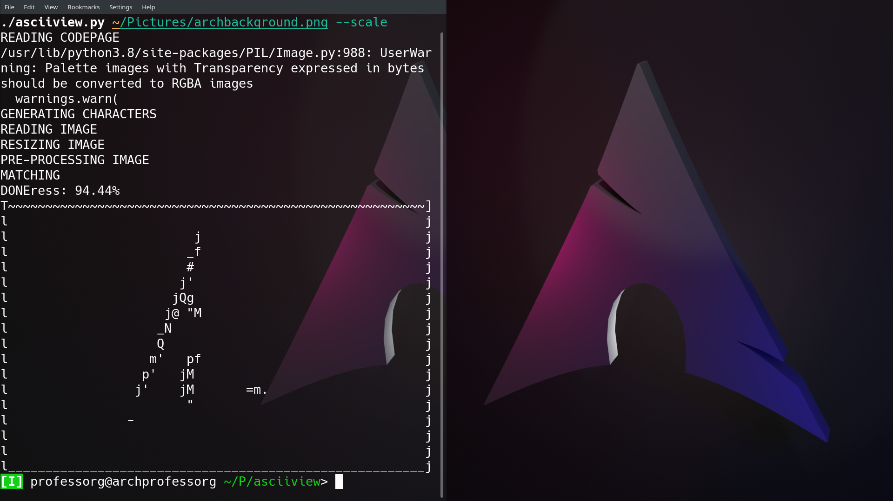
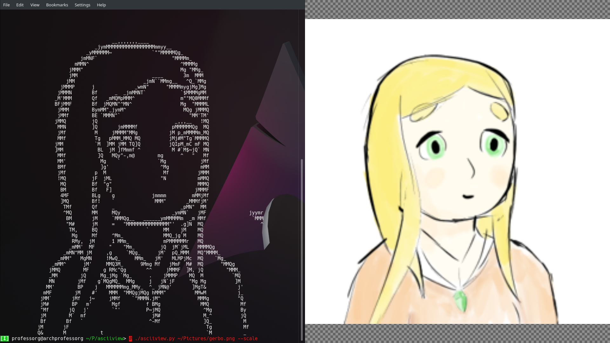

# asciiview.py

Quick project I put together a while ago. Just now getting
to putting the source online.

## What does it do?

It turns images into an ASCII art representation based on
the shape of the characters.

## How do I use it?

Use `./asciiview.py --help` for usage information.

## Examples

